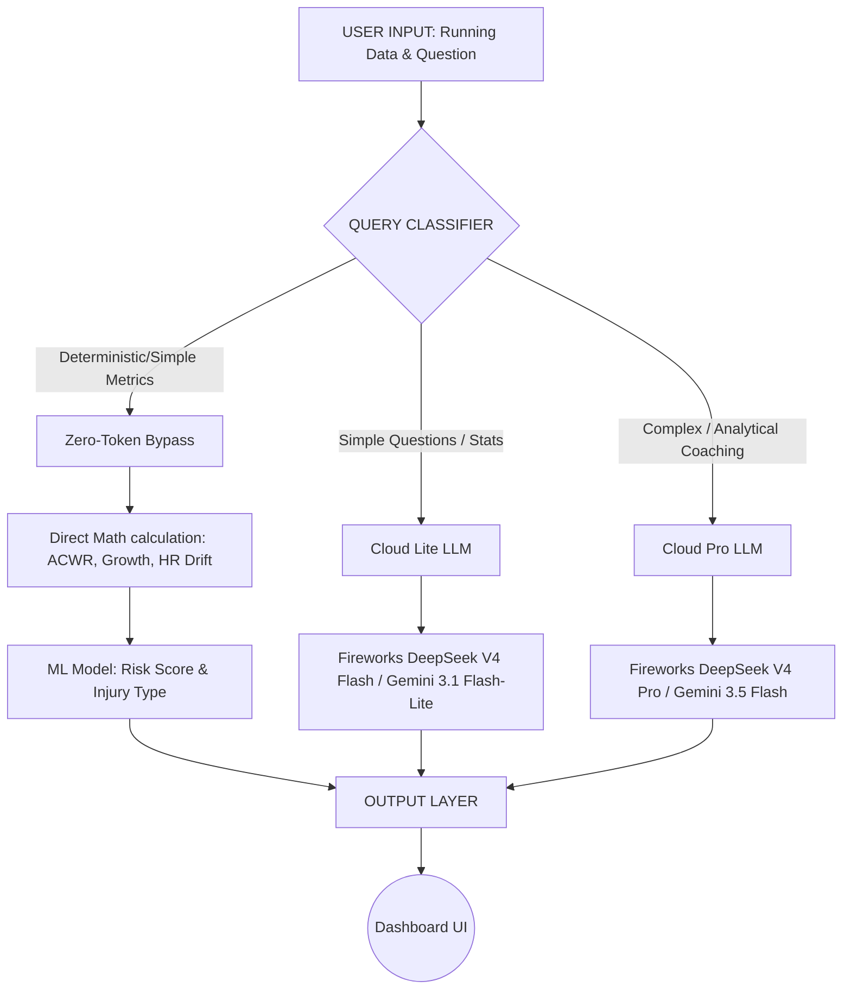

# 🎯 PaceGuard AI

> **"Train Smart. Run Far. Stay Injury-Free."**

PaceGuard AI is a next-generation **AI Running Coach** designed to predict injury risk based on running patterns (weekly load, pace, heart rate) *before* the injury actually occurs. This project was built for the lablab.ai x AMD Hackathon.

## 🚀 1. Vision & Problem Statement
*   **Problem:** Many runners (both beginner and competitive) suffer injuries due to *overtraining* (increasing distance too quickly) or unrecognized *fatigue*. Standard running tracking apps only record data without providing early warning alerts for risky training patterns.
*   **Solution:** PaceGuard AI analyzes athletic metrics (such as *Acute:Chronic Workload Ratio* / ACWR and *Heart Rate Drift*) using classic Machine Learning, then translates them into empathetic, easy-to-understand coaching advice using Large Language Models (LLMs).

---

## 🧠 2. AI Architecture & Routing (Hybrid Cloud Model Optimization)
This project demonstrates computational and cost efficiency by routing queries intelligently between Lite and Pro Cloud models (Fireworks DeepSeek V4 and Gemini).



### **"Zero-Token Decision" Mechanism**
1.  **Rule-based / Pure Calculation:** If a user asks *"What is my total distance this week?"*, the system bypasses the LLM completely (0 Tokens).
2.  **Cloud Lite LLM (DeepSeek V4 Flash / Gemini 3.1 Flash-Lite):** Used for simple questions, definitions, and basic stats to minimize token costs.
3.  **Cloud Pro LLM (DeepSeek V4 Pro / Gemini 3.5 Flash):** Executed only when the user requires in-depth coaching advice or complex analysis.

---

## 📊 3. Data Strategy & Core Features

This system is powered by three integrated datasets from Kaggle:

| Dataset (Kaggle) | Application Function | Output / Feature |
| :--- | :--- | :--- |
| **Runkeeper / Cardio Activities** | Daily & weekly activity context. | Computes ACWR, *Mileage Growth Rate*, and *Pace/HR Trend*. |
| **Competitive Runners Injury** | Injury risk classification. | Generates an **Injury Risk Score (0-100)** from training patterns. |
| **Multimodal Sports Injury** | Contextual enrichment. | Predicts probability of **specific injury types** (Knee pain, Shin splints). |

### Core Metrics (Sports Science):
*   **ACWR (Acute:Chronic Workload Ratio):** Ratio of training load in the last 7 days vs. the last 28 days. (*Safe: 0.8 - 1.3 | Danger: > 1.5*)
*   **Mileage Growth:** Weekly distance percentage increase (*Rule of thumb: Max 10%*).
*   **Heart Rate Drift:** Detects when *Heart Rate* rises significantly while *Pace* remains stable/slower (indicating *hidden fatigue*).

---

## 🖥️ 4. Mockup Dashboard (UI/UX)

The system is built using **Streamlit** for an interactive, minimalist, yet powerful user interface.

```text
┌─────────────────────────────────────────────────────────────┐
│  🏃 PaceGuard AI                          Week of Jul 7–13  │
│  "Train Smart. Run Far. Stay Injury-Free."                  │
├───────────────────────┬─────────────────────────────────────┤
│  📈 WEEKLY LOAD       │  🎯 INJURY RISK SCORE               │
│                       │                                     │
│  km                   │         71 / 100                    │
│  14 │          ██     │       ⚠️  HIGH RISK                 │
│  10 │       ██ ██     │                                     │
│   6 │    ██ ██ ██     │  Most Likely Injuries:              │
│   2 │ ██ ██ ██ ██     │  🦵 Knee pain       ████░ 72%      │
│     └─────────────    │  🦵 Shin splints    ███░░ 45%      │
│     W1 W2 W3 W4       │  🦵 Hamstring       ██░░░ 38%      │
│                       │                                     │
│  ACWR: 1.63 ⚠️        │  vs. runners like you: Top 15%     │
│  Growth: +35% ⚠️      │  aggression level                  │
├───────────────────────┴─────────────────────────────────────┤
│  📉 PACE & HEART RATE TREND                                 │
│                                                             │
│  Pace  5:23 ──────────────────────────► 4:51  ✅ Improving │
│  HR     152 ────────────────────────────► 168  ⚠️ +10%     │
│                                                             │
│  💡 Explainable AI: Your risk score is high (71) due to a   │
│     35% mileage spike and disproportionately high heart rate│
│     drift (possible hidden fatigue).                        │
├─────────────────────────────────────────────────────────────┤
│  🤖 ASK PACEGUARD (AI COACH)                                │
│  ┌─────────────────────────────────────────────────────┐   │
│  │ "What should I do next week?"                       │   │
│  └─────────────────────────────────────────────────────┘   │
│  → Coach: "Reduce volume by 20%, focus on easy pace..."    │
│  (Powered by DeepSeek V4 / Gemini 3.5)                     │
└─────────────────────────────────────────────────────────────┘
```

---

## 🛠️ 5. Execution Roadmap (Hackathon Plan)

*These phases are designed to ensure we have a demonstrable MVP as quickly as possible.*

### ✅ Phase 1: Data Engine & Math Logic (Pre-computation)
*   [x] Extract/download sample data from Runkeeper dataset (CSV).
*   [x] Create Python functions to calculate `ACWR` and `Mileage Growth`.
*   [x] Create Python functions to detect negative correlation of `Pace` vs. `Heart Rate`.
*   [x] Train Random Forest models (Sklearn) to map these metrics to a 0-100 probability (Risk Score) and classify injury condition.

### ✅ Phase 2: "The Brain" (LLM Integration)
*   [x] Setup API Keys for Fireworks.ai and Gemini.
*   [x] Create *Prompt Engineering* functions that ingest metrics JSON (Risk Score, ACWR, etc.) and compile instructions for the LLM.
*   [x] Create a simple *Router* function to partition light queries (to Cloud Lite LLM) and heavy queries (to Cloud Pro LLM).

### ✅ Phase 3: Streamlit Dashboard
*   [x] Initialize `app.py`.
*   [x] Build visual components (Bar chart for Weekly Load, Progress bar for Injury Risk).
*   [x] Integrate Engine (Phase 1) and Brain (Phase 2) into Streamlit Session State.

### ✅ Phase 4: Persona & Demo Polish
*   [x] Prepare 3 dummy runner scenarios for demo pitching:
    *   `Andrew` (Safe Runner) -> Green metrics, ideal ACWR, positive coaching advice.
    *   `Stephen` (Overtrained Runner) -> Red ACWR (>1.5), high risk of knee/shin injuries.
    *   `Claudia` (Fatigued Runner) -> Safe mileage, but high HR Drift (>10%).
*   [x] Rehearse pitching narrative, emphasizing token cost savings (Hybrid Cloud LLM Routing).

